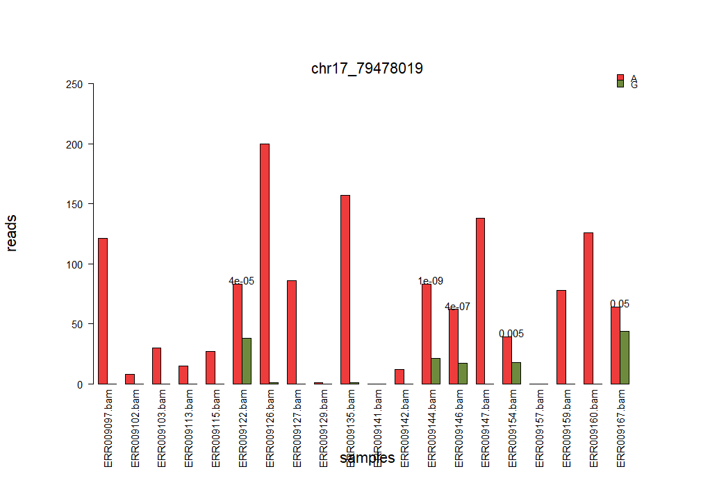

# Genomic Data Exploration: Visualizing Genetic Variants and Allelic Imbalance

## Project Overview
This repository showcases advanced bioinformatics techniques, focusing on RNA sequencing data and genomic databases. Utilizing R, the project delves into analyzing allelic imbalance, constructing phylogenetic trees, identifying SNP variants, and creating complex visualizations. It highlights my ability to translate complex genomic data into meaningful insights and demonstrates my data analysis skills.

## Installation
To run the script provided in this repository, the following R packages need to be installed. Here are the installation instructions:

```R
if (!requireNamespace("BiocManager", quietly = TRUE))
    install.packages("BiocManager")
BiocManager::install(c("AllelicImbalance", "VariantAnnotation", "ape", "ComplexHeatmap"))
```

## Project Structure
- **[/data/](data/)**: Contains instructions and links for accessing the datasets used in the analyses.
  - **Allelic Imbalance Data**: Instructions provided for accessing data via the `AllelicImbalance` R package.
  - **Phylogenetic Tree Data**: Directly included in this repository for immediate access.
- **[/script/](script/)**: Contains R scripts developed for data processing, analysis, and visualization. Each script is well-documented to explain its functionality and usage.
- **[/results/](results/)**: Includes output files and visualizations generated from the scripts, such as plots and heatmaps.

## Usage
To run these analyses:

1. Ensure R and all required packages are installed.
2. Clone this repository to your local machine.
3. Navigate to the `/script/` directory.
4. Run the R script.

## Results and And Discussion
Each result and visualization is stored in the `/results/` directory. These include:


- **Bar Plot of Allelic Imbalance (chr17_79478019.png)**



This bar plot visualizes the mean counts of nucleotides (ACGT) across multiple files for the specific genomic position chr17_79478019. The visualization highlights allelic imbalances crucial in understanding genetic diversity and potential mutations at this location. By comparing the frequency of each nucleotide, researchers can identify significant variations that may be associated with genetic conditions or evolutionary changes. This graph is particularly useful for pinpointing areas within the genome that exhibit non-standard allelic distributions, which might suggest areas of interest for further genetic analysis or clinical investigation.

- **Phylogenetic Trees**: Includes two phylogenetic trees:
  - A tree constructed using the `ape::read.tree` function demonstrating the evolutionary relationships in a cladogram style without tip labels.
  - A detailed view of the smallest subtree containing Homo sapiens and Drosophila melanogaster, illustrating their genetic relationship and evolutionary distance, scaled down to enhance visibility.
  
These visualizations are instrumental in understanding the genetic variations and their implications for health and disease, providing a visual interpretation of complex genomic data interactions.

## Contact
For any further inquiries or potential collaborations, please feel free to contact me at gita.bhardwaj1@gmail.com.
